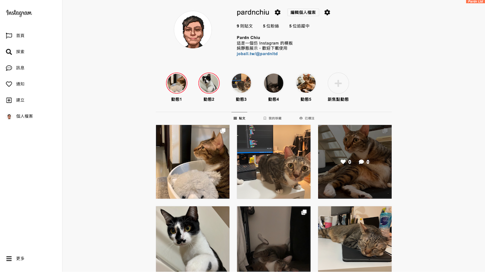
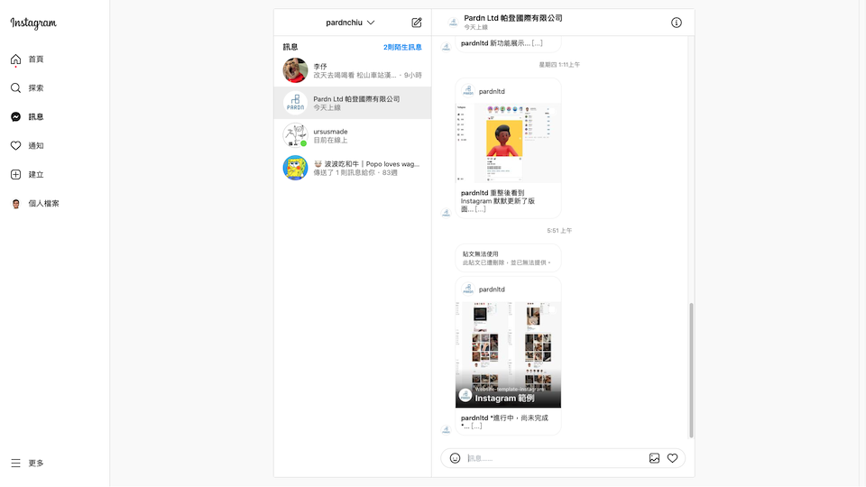

# Instagram 範例

*介面為 2022/10 版本*

- 預覽: [Github.io](https://pardnchiu.github.io/instagram-template-202210/)
- 源碼: [Github.page](https://github.com/pardnchiu/instagram-template-202210/)
- 授權: [MIT LICENSE](https://github.com/pardnchiu/instagram-template-202210/blob/main/LICENSE)
- 開發: [Pardn Chiu 邱敬幃](https://pardnchiu.github.io/)
  
***

- 工具: Html, Css/Sass, Javascript
- LOGO: [Wiki](https://zh.m.wikipedia.org/zh-tw/File:Instagram_logo.svg)
- 圖示: [Font Awesome 5](https://fontawesome.com)
- 頭像: [Userpics](https://userpics.craftwork.design)

***

| Instagram | Sample |
| :-: | :-: |
|  首頁 |  首頁 |
|  |  |
| 限時動態 | 限時動態 |
|  |  |
| 搜尋 | 搜尋 |
|  |  |
| 通知 |  通知 |
|  |  |
| 個人頁 | 個人頁 |
|  |  |
| 彈出式貼文 | 彈出式貼文 |
|  |  |
| 單頁貼文 | 單頁貼文 |
|  |  |
| 訊息 | 訊息 |
|  |  |
 
