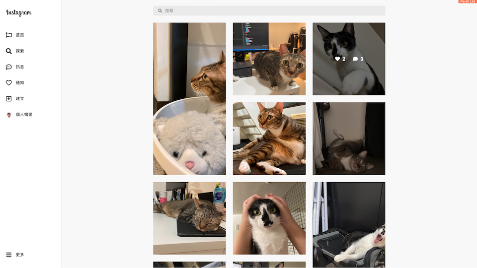
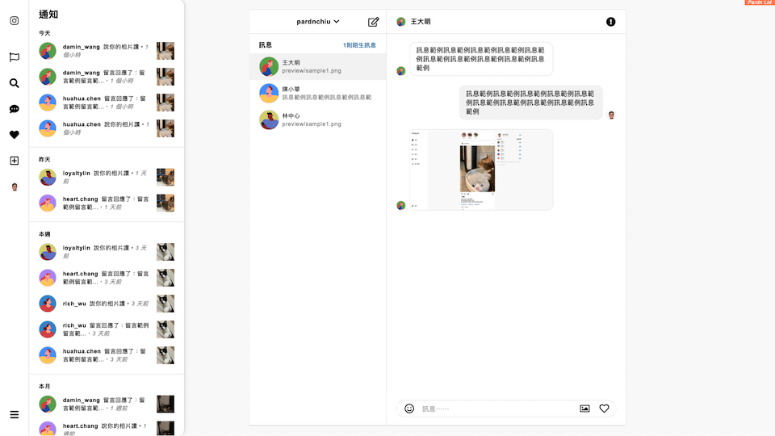
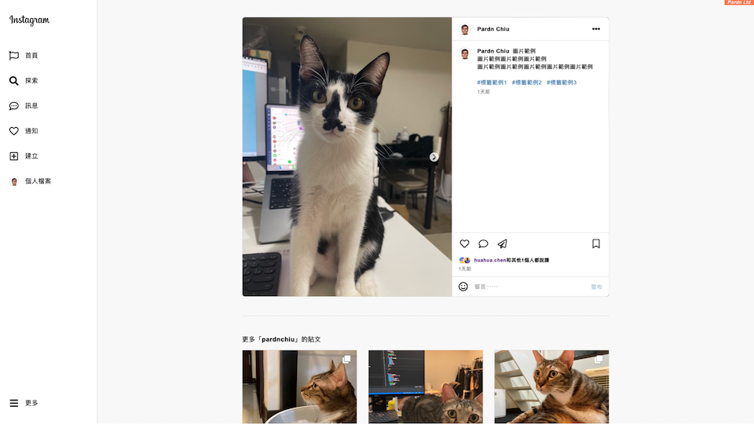
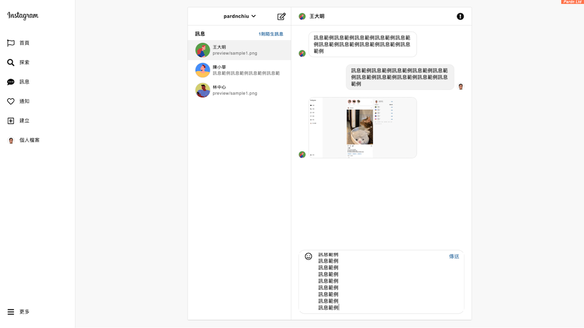

# Instagram 範例

*版本為 2022/10*

*當前僅保證適配寬度1024以上，抽空著手調整手機版*

- 預覽: [Page](https://pardnchiu.github.io/instagram-template-202210)
- 源碼: [Github](https://github.com/pardnchiu/instagram-template-202210)
- 授權: [MIT LICENSE](https://github.com/pardnchiu/instagram-template-202210/blob/main/LICENSE)
- 工具: Html, Css/Sass, Javascript
- 開發: [Pardn Chiu](mailto:chiuchingwei@icloud.com)
  
***

- LOGO: [Wiki](https://zh.m.wikipedia.org/zh-tw/File:Instagram_logo.svg)
- 圖示: [Font Awesome 5.1](https://fontawesome.com)
- 頭像: [Free Userpics Pack](https://userpics.craftwork.design)

***

| *為 Instagram 2022/10/17 版本* |  |
| :-: | :-: |
| Instagram 首頁 | Sample 首頁 |
|  |  |
| Instagram 限時動態 | Sample 限時動態 |
|  |  |
| Instagram 搜尋 | Sample 搜尋 |
|  |  |
| Instagram 通知 | Sample  通知 |
|  |  |
| Instagram 個人頁 | Sample 個人頁 |
|  |  |
| Instagram 彈出式貼文 | Sample 彈出式貼文 |
|  |  |
| Instagram 單頁貼文 | Sample 單頁貼文 |
|  |  |
| Instagram 訊息 | Sample 訊息 |
|  |  |
 
